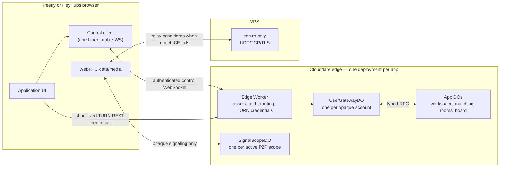

# Durable Objects architecture and implementation plan

Status: proposed implementation plan  
Date: 2026-07-23  
Applies to: Peerly, HeyHubs, `@peerly/core`, and production network infrastructure

This document decides what to build and why. The exact file map, wire
schemas, SQL DDL, crypto recipes, endpoint contracts, algorithms, tests, and
PR-by-PR sequence live in the companion
[implementation guide](./DURABLE_OBJECTS_IMPLEMENTATION.md); implementers
follow that guide and treat this document as the authority on intent.

## Decision

Move the application control plane from the self-hosted Node/WebSocket relay to
Cloudflare Workers and SQLite-backed Durable Objects (DOs). Keep media, calls,
chat, files, and other private user content peer-to-peer over WebRTC. The VPS
will run coturn as its only application workload; it will not run signaling,
matching, discovery, presence, or application APIs. Phase 6 additionally
evaluates replacing self-hosted coturn with Cloudflare Realtime TURN; if
measured relay egress fits its free tier, the VPS is retired entirely.

The existing relay is now maintenance-only:

- Allowed: security, correctness, dependency, protocol-compatibility, and
  operational fixes.
- Not allowed: new commands, new stored state, new product features, new
  coordination responsibilities, or new consumers.
- It remains an explicit rollback backend during the DO rollout. Clients never
  write to both backends at once.
- After the DO path meets the exit criteria in this plan, the relay service and
  its HTTP/WebSocket proxy are disabled on the VPS. The source stays available
  for emergency rollback and fixes until a later removal decision.

The new backend is configurable, but it will not be a dormant experiment.
Production changes to `durable-objects` in the first complete rollout:

```text
COORDINATION_BACKEND=durable-objects
LEGACY_RELAY_ENABLED=false
```

An emergency deployment may set `COORDINATION_BACKEND=legacy-relay`. Automatic
per-client relay fallback is deliberately excluded because it would split
presence, matchmaking, and room directories across two authorities.

## Goals and non-goals

### Goals

- One reliable, authenticated Cloudflare control plane for both applications.
- One hibernatable WebSocket connection per signed-in app session for control
  traffic, plus a short-lived signaling socket for each active WebRTC scope.
- Durable, idempotent matching and room-directory operations.
- Established P2P sessions continue if the control plane is temporarily
  unavailable.
- No static relay or TURN credential in a browser bundle.
- Low latency, bounded work, bounded storage, and explicit overload behavior.
- Stay within the Cloudflare Workers Free plan at current traffic, with quota
  alarms and a documented paid-plan threshold instead of silent failure.
- Shared protocol, client, security, and test utilities in `@peerly/core`, with
  separate Peerly and HeyHubs deployments and DO namespaces.

### Non-goals

- Durable Objects do not carry WebRTC audio/video, chat messages, files, or
  Peerly workspace history.
- The migration does not add features to the legacy relay.
- “Free” is not treated as unlimited or as an availability SLA. TURN VPS and
  bandwidth costs remain outside the Cloudflare application-plane budget.
- The two apps do not share user data or DO namespaces merely because they
  share code.
- A second cloud provider is not part of the first implementation.

## Platform constraints and budget

The design is based on the Cloudflare documentation and Wrangler schema current
on 2026-07-23:

- [Workers pricing](https://developers.cloudflare.com/workers/platform/pricing/)
- [Durable Objects pricing](https://developers.cloudflare.com/durable-objects/platform/pricing/)
- [Durable Objects limits](https://developers.cloudflare.com/durable-objects/platform/limits/)
- [Durable Objects WebSockets](https://developers.cloudflare.com/durable-objects/best-practices/websockets/)
- [Durable Objects design rules](https://developers.cloudflare.com/durable-objects/best-practices/rules-of-durable-objects/)
- [Durable Object lifecycle](https://developers.cloudflare.com/durable-objects/concepts/durable-object-lifecycle/)
- Wrangler `4.113.0` schema and runtime types generated by `wrangler types`
  (neither repo pins `@cloudflare/workers-types`)

The relevant Free-plan allowances are currently 100,000 DO requests/day,
13,000 GB-s/day, 5,000,000 SQLite rows read/day, 100,000 SQLite rows
written/day, and 5 GB stored. Only SQLite-backed DO classes are available on
the Free plan. These allowances can change and must be checked before each
capacity review.

WebSocket design has a large cost impact:

- Use `ctx.acceptWebSocket()`, `ctx.getWebSockets()`, tags, and serialized
  attachments. Do not use the standard `WebSocket.accept()` API.
- Do not keep objects awake with `setInterval()` or application heartbeat
  timers. Use WebSocket auto-responses and alarms.
- Incoming WebSocket messages are currently billed in 20:1 groups; outgoing
  WebSocket messages and protocol-level pings are not billed as requests.
- Batch non-urgent deltas for 50-100 ms, with hard byte and item caps.
- Presence inside a user gateway is connection-derived from attached sockets.
  Cross-object presence/statistics uses a coarse expiring lease written on
  connect, clean close, and infrequent renewal—not on an application heartbeat.
- SQLite writes occur on meaningful transitions: start/cancel seek, publish or
  delete directory entry, create or acknowledge an invitation, and publish a
  board event.

Request and duration amplification rules that shaped the topology:

- Each cross-object RPC session is billed as a request on the callee, and each
  `setAlarm()` is billed as one row written. A command that touches one
  gateway plus N shards bills N+1 requests, so fan-out is a budgeted design
  decision, not an implementation detail.
- One continuously active object costs about 10,800 GB-s/day
  (0.125 GB × 86,400 s) — 83% of the entire Free duration allowance by
  itself. Hibernation is the budget, not an optimization.
- Worker caches are per-location. A "cached" aggregate refreshes independently
  in every colo with traffic, multiplying shard fan-in by the number of
  active locations.
- The Workers Free plan separately meters 100,000 Worker requests/day. Static
  assets are unmetered, but every `/api/*` call and WebSocket upgrade counts,
  so client polling must be demand-driven and visibility-gated.
- A single object has a soft throughput ceiling of roughly 1,000 requests/s.
  Shards exist for that ceiling; at current scale shard constants start at
  one.

Free operation is an engineering target, not a guarantee. The production
Worker must fail closed with `429`/`503` and `Retry-After` before Cloudflare
quota exhaustion causes undefined user-facing behavior.

## High-level architecture

Each app deploys its own Worker and DO namespaces. The implementations are
shared through `@peerly/core`, but Peerly and HeyHubs have separate data,
secrets, migrations, dashboards, and failure domains.



### Why deployments remain separate

- A bad HeyHubs board or matchmaking release cannot evict Peerly workspace
  coordination.
- App-specific origin, identity, privacy, rate, and retention policies stay
  independent.
- Each repository can deploy and roll back without synchronizing the other.
- Shared source still prevents protocol and security logic from drifting.

## Shared package layout

Add the following under `packages/core` and publish it before app cutover:

```text
packages/core/
  src/realtime/
    client.ts                 reconnect, resume, batching, backpressure
    protocol.ts               schemas, frame limits, version negotiation
    transport.ts              durable-objects | legacy-relay selection
    limits.ts                 client-visible constants re-exported from limits.mjs
    types.ts
  worker/realtime/
    index.mjs                 re-exports every shared DO class and route handler
    auth.mjs                  enrollment, session cookie, origin checks
    crypto.mjs                HMAC tokens, opaque ids, nonce, device signatures
    router.mjs                HTTP/WebSocket routing to namespaces
    limits.mjs                byte, rate, connection, and storage caps
    userGateway.mjs
    signalScope.mjs
    workspace.mjs             Peerly only
```

`InterestQueueDO`, `PresenceStatsShardDO`, `RoomDirectoryShardDO`, and (after
the Phase 7 privacy gate) `BoardShardDO` are HeyHubs-only and are implemented
in the HeyHubs repo's own `worker/realtime/`, not in `packages/core`: each has
exactly one consumer, so core carrying them would mean Peerly source holding
HeyHubs product code (matching, presence stats, room/board content) with no
shared-code benefit. They import `LIMITS`, `deriveScopeRouteId`, and other
shared primitives from `@peerly/core/worker/realtime` like any other consumer
of the package — the wire protocol, crypto, auth, and `UserGatewayDO`/
`SignalScopeDO` they call into remain single-implementation and shared.

The browser-facing app code imports interfaces, not DO-specific classes. The
legacy relay adapter and the DO adapter implement the same narrow application
ports, but they do not share server implementations.

## Authentication and session establishment

The browser WebSocket API cannot attach an `Authorization` header. Credentials
must not be placed in a URL query string because URLs are commonly logged.

Use this flow:

1. `POST /api/network/enroll`
   - Require an unexpired OIDC ID token.
   - Require a server nonce signed by the existing P-256 device key.
   - Verify issuer, audience, expiry, origin, user ID, public key, signature,
     replay nonce, and request size.
   - Return a 30-day, app/audience-bound device-session capability. It contains
     an opaque HMAC user ID, device-key ID, session ID, issued/expiry times, and
     token version. The raw email and provider subject are not included.
   - Persist the capability in IndexedDB; never persist the OIDC token.

2. `POST /api/network/session`
   - Require the device-session capability, a fresh server nonce, and a device
     signature.
   - Consult the user DO for revoked session/device epochs.
   - Set a 10-minute `Secure; HttpOnly; SameSite=Strict` cookie scoped to
     `/api/realtime`.
   - Return current public runtime config and short-lived TURN REST
     credentials. Never return the TURN shared secret.

3. `GET /api/realtime/control` with `Upgrade: websocket`
   - Validate exact `Origin`, cookie MAC, audience, expiry, app, and protocol
     version.
   - Route to `UserGatewayDO` by the opaque user ID.
   - The DO accepts the socket with the hibernation API and serializes only
     bounded metadata: connection ID, device-key ID, session ID, scopes,
     protocol version, and last acknowledged sequence.

4. Renewal
   - Refresh the cookie before expiry through `/api/network/session`.
   - A socket may live longer than the cookie, but every privilege-changing
     command rechecks the device/session epoch.
   - A 30-day application session created before device enrollment performs one
     explicit reauthentication. Do not silently weaken enrollment to preserve
     it.

5. Signaling-scope authorization
   - Request a signal scope over the authenticated control socket; do not put
     its secret in the upgrade URL.
   - The gateway derives an opaque route ID, registers the authenticated
     user/device and a short expiry with the target `SignalScopeDO`, and returns
     only the route ID.
   - The browser upgrades `/api/realtime/signal/{routeId}` with its HttpOnly
     network cookie. The route ID is not a bearer credential: the target object
     also requires the cookie subject/device to have a live authorization row.

Use independent secrets in each environment:

```text
NETWORK_SESSION_SECRET
OPAQUE_USER_ID_SECRET
TURN_AUTH_SECRET
GOOGLE_CLIENT_ID
MICROSOFT_CLIENT_ID             # Peerly when enabled
APPLE_CLIENT_ID                 # Peerly when enabled
```

Rotate signing secrets with `{current, previous}` key IDs so active sessions
have a bounded transition window. A compromised device is revoked by advancing
its epoch in `UserGatewayDO`; a compromised global secret requires a forced
session renewal.

## Wire protocol

Use a versioned envelope for every control frame:

```ts
type RealtimeFrame = {
  v: 1
  id: string          // idempotency key, unique per sender command
  type: string        // closed union in the shared schema
  scope?: string      // opaque, bounded coordination scope
  seq?: number        // server stream sequence
  sentAt: number
  payload: unknown
}
```

Rules:

- Parse as bytes first and reject frames over 32 KiB before JSON decoding.
- Validate every frame against a closed schema; discard unknown fields.
- Cap strings, arrays, map entries, tags, directory entries, and fanout.
- Mutating commands carry an idempotency key stored for a bounded TTL.
- The server sends `ack`, `error`, `snapshot`, and ordered `delta` frames.
- Clients retain the last applied sequence and request `resume`.
- If the cursor is no longer retained, send a snapshot rather than replaying an
  unbounded log.
- Batch non-urgent deltas; never batch authentication, matching commit, revoke,
  or leave/close acknowledgements.
- Backpressure policy is explicit: coalesce presence/stat updates, reject new
  bulk work, and close a consistently slow consumer with a retryable code.
- Protocol version negotiation occurs before subscriptions. Unsupported
  versions fail closed with an actionable upgrade code.

## Durable Object topology

Never route all users to one global object. An object represents one
coordination atom and has hard caps.

### `UserGatewayDO`

Key: `app + environment + opaqueUserId`

Responsibilities:

- Own all active control sockets for one account across a maximum of three
  devices.
- Enforce device/session epochs and connection caps.
- Multiplex presence, invitations, DM rings, sync notices, matching outcomes,
  and directory deltas onto one browser socket.
- Hold the authoritative per-user matchmaking state and reservation.
- Deduplicate commands and outgoing events.
- Deliver a bounded snapshot after hibernation/restart.

Persistence:

- Device/session revocation epochs.
- Current seek ID, state, reservation, and expiry.
- Bounded offline invitation/ring mailbox where the product requires it.
- Recent idempotency keys with expiry.

Connections are recovered using `ctx.getWebSockets()` and
`deserializeAttachment()`. No in-memory map is treated as authoritative after
hibernation.

### `SignalScopeDO`

Key: `app + environment + HMAC(scope capability)`

Responsibilities:

- Forward only opaque WebRTC offer/answer/ICE signaling envelopes.
- Enforce authenticated membership/capability, maximum participants, maximum
  message size, and per-connection rate.
- Support a small compatibility surface required by the current Trystero
  client while the app-facing transport is moved to `durable-objects`.
- Never store chat, files, media, SDP history, or ICE history.

One active chat, DM, room, or Peerly workspace maps to one scope. Public room
codes and workspace secrets are not used directly as DO names. Peerly keeps its
existing device/workspace authorization handshake before accepting user data;
the DO grants signaling access, not content trust.

The raw capability travels only inside the authenticated control channel. Its
HMAC-derived route ID may appear in the WebSocket path because knowing that ID
alone grants nothing; authorization is an expiring user/device row inside the
scope object.

### `WorkspaceDO` — Peerly only

Key: `peerly + environment + opaqueWorkspaceScope`

Responsibilities:

- Workspace presence and connection metadata.
- Signed member/device capability versions and revocation notices.
- Host/owner lease and bounded signaling-scope metadata when needed.
- Delivery of friend-invite and device-sync notifications through user
  gateways.

Private workspace messages, files, reactions, calls, and history remain P2P and
locally persisted. The first migration keeps the existing invite-secret-derived
scope plus peer authorization. A later capability-ledger step may centralize
revocation only after existing-workspace migration and ownership recovery have
explicit tests.

### `InterestQueueDO` — HeyHubs only

Key: `heyhubs + environment + normalizedInterest`

Responsibilities:

- Store bounded, expiring seek leases for one interest.
- Propose compatible pairs while respecting user exclusions and recent-partner
  cooldowns.
- Coordinate with each user gateway to prevent duplicate matches across
  multiple interests.

A seeker may register in at most five normalized interest queues under one
`seekId`. Multiple queues can propose the same user, so matching uses a
two-phase reservation:

1. The queue chooses two compatible seek leases.
2. It reserves each `UserGatewayDO` in lexical opaque-user-ID order.
3. If both reservations succeed, it commits both and delivers one match ID and
   room capability.
4. If either reservation fails, it releases the other.
5. Reservation expiry is enforced by the gateways' next alarms.
6. Stale queue rows may remain until TTL; gateway state is authoritative, so a
   stale row cannot produce a second committed match.

This preserves “any shared interest” matching without a global matchmaking DO
and without forcing users with overlapping-but-different tag sets into
different permanent buckets.

### `PresenceStatsShardDO` — HeyHubs only

Key: `heyhubs + environment + shard`, shard count from a deployed constant,
initially 1

Responsibilities:

- Maintain best-effort online and interest-count deltas outside the matching
  correctness path.
- Produce a short-lived aggregate snapshot through the edge Worker.

One object holds both presence leases and interest counters at current scale;
account and interest hashes spread across shards only after the constant is
raised. The sizing follows from the amplification rules: every shard RPC is a
billed request and Worker caches are per-colo, so a 16-way fan-in refreshed
every 15 seconds would bill ~92,000 requests/day from a single busy location —
the entire Free request allowance for a vanity counter. A single object
refreshed on demand costs a few thousand. Raise the shard constant only when
one object approaches its throughput ceiling; counters republish as
idempotent absolute values on change and on wake, so re-sharding self-heals
within one lease TTL.

Snapshot reads are demand-driven: clients request counts only while a
discovery surface is visible, at a 30-second minimum interval, pausing when
the page is hidden. The Worker caches the merged snapshot for 30 seconds per
location. An online account gets a coarse one-hour lease: connect and normal
close update it immediately, while a still-connected gateway renews it at
half-life. Expiry cleans up a missed close. A lost stats RPC self-repairs on
the next absolute publish. Matching never depends on a displayed count.

### `RoomDirectoryShardDO` — HeyHubs only

Key: `heyhubs + environment + hash(roomCode) % shardCount`, using the same
deployed shard constant, initially 1

Responsibilities:

- Store signed, expiring public-room announcements.
- Enforce owner/device identity, capacity bounds, TTL, and monotonic revisions.
- Return cursor-paginated listings with a strict maximum.

Listing carries a cursor per shard and the client merges a bounded page; with
one shard that is one RPC per page. Announcements expire, so raising the
shard constant re-buckets naturally within one announcement TTL — stale
entries in old shards age out on their own. There is no unbounded “list every
room” call.

### `BoardShardDO` — HeyHubs only, separate privacy gate

Key: `heyhubs + environment + month + category + shard`

Responsibilities:

- Store immutable, signed board events and tombstones.
- Validate identity binding, signature, revision ownership, size, category,
  and retention before writing.
- Return cursor-paginated events and resume deltas.

This phase changes the current statement that the application backend stores no
board content. It cannot ship until the Privacy Policy and retention text are
updated and accepted. Store no private messages or raw uploaded avatar data.
Cap a board event at 32 KiB and retain it for the documented period (proposed:
90 days for posts/comments, 30 days for reaction events, with tombstones long
enough to prevent resurrection). If this privacy change is not approved, keep
the signed P2P board and accept that offline durability is not guaranteed.

## Persistence and concurrency rules

- Use SQLite-backed DO classes and a checked-in migration history.
- Initialize tables synchronously in the constructor. Use
  `blockConcurrencyWhile()` only for unavoidable async initialization.
- Related SQL changes execute without an external `await` between them.
- Persist correctness state before acknowledging it; in-memory values are
  caches only.
- One alarm per object schedules the nearest expiry. Alarms are idempotent,
  retry-safe, and reschedule themselves from persisted rows.
- Every table has bounded retention and an indexed expiry column.
- Never enumerate an entire namespace or scan an unbounded table in a request.
- Cross-DO calls use typed RPC methods. Browser upgrades necessarily enter
  through Worker/DO `fetch()`.
- Cross-DO operations have explicit timeouts, idempotency keys, and compensating
  release behavior. There is no assumption of a distributed transaction.
- A DO constructor, hibernation wake, or retry may happen at any point covered
  by tests.

Initial Wrangler shape in each app:

```jsonc
{
  "durable_objects": {
    "bindings": [
      { "name": "USER_GATEWAYS", "class_name": "UserGatewayDO" },
      { "name": "SIGNAL_SCOPES", "class_name": "SignalScopeDO" }
    ]
  },
  "migrations": [
    {
      "tag": "realtime-v1",
      "new_sqlite_classes": ["UserGatewayDO", "SignalScopeDO"]
    }
  ],
  "observability": {
    "enabled": true,
    "head_sampling_rate": 1
  }
}
```

Add app-specific bindings and include the non-inheritable `durable_objects`
block in every Wrangler environment, including `preview`. Migration tags are
append-only and are never renamed after deployment. Both repos already deploy
`head_sampling_rate: 1`; keep full sampling through the rollout at current
traffic and lower it only if Workers Logs quota pressure appears.

## Client behavior

Implement a single explicit connection state machine:

```text
offline -> enrolling -> session -> connecting -> ready
   ^          |           |           |          |
   +----------+-----------+-----------+----------+
                  retryable failure
```

- Exponential reconnect with full jitter: 250 ms base, 30 s cap.
- Refresh session before reconnect when the cookie is stale.
- Browser online/visibility events may trigger an immediate attempt but do not
  reset the backoff repeatedly.
- Resume from the last acknowledged server sequence.
- Maintain a bounded command queue; discard superseded presence/stat commands.
- Never retry non-idempotent work without the original command ID.
- Surface `auth-required`, `rate-limited`, `service-unavailable`, and
  `client-upgrade-required` separately.
- Preserve established WebRTC sessions if the control socket drops.
- Do not start matching or publish directory state on the legacy backend while
  a DO session is active.
- Expose transport, reconnect count, last successful event, and degraded state
  in the existing diagnostics UI without exposing identifiers or tokens.

## Rate, abuse, and resource limits

Start with conservative server-enforced defaults:

| Resource | Initial cap |
| --- | ---: |
| Control sockets per account | 3 |
| Signal sockets per device | 8 |
| Participants per signal scope | 16 |
| Control frame | 32 KiB |
| Signaling frame | 16 KiB |
| Commands per control socket | 20/s burst, 5/s sustained |
| Signaling messages per socket | 50/s burst, 20/s sustained |
| Interests per seek | 5 |
| Seek lease | 30 minutes |
| Public room listing payload | 8 KiB |
| Directory page | 50 entries |
| Offline invitation mailbox | 100 entries/account |
| Idempotency retention | 24 hours |

Limits live in shared server code, are tested at boundaries, and can only be
changed by deployment. Close abusive sockets with a documented code; do not
continue parsing after a hard limit is crossed. Log only coarse reason codes,
opaque IDs, byte counts, and latency.

## Performance and reliability targets

These are observed SLO targets, not a Free-plan Cloudflare SLA:

| Path | Target |
| --- | --- |
| Warm control reconnect | p95 under 1 second |
| Cold control connect | p95 under 2 seconds |
| Signaling delivery inside a scope | p95 under 300 ms |
| Match commit after compatible candidates exist | p95 under 1 second |
| Directory snapshot | p95 under 500 ms, at most 50 entries |
| Recovery after network restoration | p95 under 5 seconds |
| Duplicate committed matches | zero |
| Unauthorized cross-scope delivery | zero |
| Lost acknowledged durable command | zero |

Reliability mechanisms:

- Hibernatable sockets and attachment recovery.
- Persist-before-ack for durable state.
- SQLite point-in-time recovery bookmarks (30 days) for operator-driven
  restore after a corruption-class defect.
- Idempotent commands, monotonic revisions, bounded replay, and snapshots.
- Deterministic reservation order for matchmaking.
- Exponential reconnect and resumption.
- Established P2P sessions remain independent of the control plane.
- Preview smoke tests before production and immediate rollback by one backend
  configuration change.
- A synthetic probe enrolls a test device, opens a control socket, performs a
  scoped round trip, and verifies a TURN allocation without joining real user
  scopes.

## Observability and quota controls

Emit structured events with:

- app, environment, class, operation, result, protocol version;
- duration, message bytes, fanout count, retry count, storage row count;
- opaque object/request IDs; and
- no emails, provider subjects, room secrets, SDP, ICE candidates, content, or
  bearer credentials.

Dashboards and alerts:

- connection/open/close rates and close reasons;
- auth failures and revoked-device attempts;
- p50/p95/p99 RPC and delivery latency;
- DO exceptions, alarm retries, hibernation wakes, and storage failures;
- match proposal/reservation/commit/release counts;
- directory and board write/read counts;
- estimated requests, GB-s, rows read/written, and stored bytes versus 50%,
  75%, and 90% of the Free allowance;
- TURN credential requests and successful client allocation checks.

At 75%, increase batching/cache TTLs and reduce nonessential snapshot refresh.
At 90%, reject board bulk synchronization and nonessential stats first while
preserving authentication, active signaling, matching commits, and explicit
leaves. If ordinary traffic repeatedly exceeds 75%, move to Workers Paid; do
not distort correctness to stay nominally free.

## Test strategy

### Unit and protocol tests

- Closed schema and every size/count boundary.
- Authentication claims, origins, cookie scope, expiry, rotation, revocation,
  nonce replay, and device signatures.
- Object-name derivation cannot reveal provider identity or secrets.
- Idempotency, monotonic sequence/revision, snapshot/resume, and stale cursor.
- Backpressure coalescing and slow-consumer closure.
- Match reservation races across two interests, disconnects at every step,
  duplicate delivery, stale leases, exclusions, and cooldowns.
- Directory ownership, expiry, pagination, and shard cursor merge.
- Board ownership, tombstones, retention, and privacy caps if that phase ships.

### Worker integration tests

Use `@cloudflare/vitest-pool-workers` with real DO bindings:

- Multiple isolated object instances and app/environment namespaces.
- Hibernation wake with only serialized attachments and SQLite state.
- Alarm retry and earliest-expiry rescheduling.
- Concurrent RPC calls and failed compensation.
- WebSocket upgrade, message, close, and error handlers.
- Preview/prod Wrangler binding and migration validation.

### Browser end-to-end tests

For both apps:

- enroll two independent device keys, connect, disconnect, and resume;
- direct WebRTC succeeds with DO signaling;
- forced TURN succeeds with short-lived credentials from the Worker;
- a live P2P call/chat survives control-socket loss;
- legacy backend works only when explicitly configured;
- no credential appears in built JavaScript, local/session storage, URLs, or
  browser logs.

Peerly:

- invited workspace join, presence, reconnect, revocation, friend invite, DM
  ring, and approved-device sync notification;
- unauthorized workspace/user scopes cannot observe or signal each other.

HeyHubs:

- any-overlapping-interest match, simultaneous multi-tag proposals, cancel,
  skip/cooldown, disconnected candidate, and reconnect;
- room publish/update/delete/expiry and bounded paginated listing;
- online/interest counters repair after a forced restart;
- board offline catch-up and tombstone behavior if durable board storage ships.

### Load and fault tests

- Sustained connections with no application messages verify hibernation and
  near-zero duration growth.
- Burst reconnect, matching, directory, and signaling at 2x expected peak.
- Inject duplicate/out-of-order frames, RPC timeouts, socket termination,
  constructor restart, alarm retry, and partial two-user reservations.
- Record daily quota projection from the load profile and block rollout if the
  expected peak plus 2x safety margin exceeds 75% of a Free allowance.
  Project as explicit line items: WebSocket upgrades, incoming messages ÷ 20,
  RPC sessions, alarm invocations, Worker `/api/*` requests, rows
  read/written (including one row write per `setAlarm()`), and duration from
  observed active seconds × 0.125 GB.

## Implementation sequence

Each phase is a separate, reviewable PR or small PR series. Do not mix a
protocol migration with unrelated product work.

### Phase 0 — freeze and baseline

1. Add this decision and the HeyHubs execution checklist.
2. Add a relay maintenance policy to contributor documentation and PR review.
3. Capture current production request rates, connected clients, match starts,
   room updates, board events, and TURN allocations for seven days.
4. Record the current relay protocol as compatibility fixtures; no new relay
   message types after this point.
5. Confirm Cloudflare Free allowances, custom-domain routing, and preview
   namespace configuration before implementation.

Exit: baseline report exists; relay scope is frozen; no current behavior is
unowned by the migration matrix.

### Phase 1 — shared protocol, auth, and gateway

1. Add the shared protocol schemas, limits, DO client, and transport port to
   `@peerly/core`.
2. Implement enrollment/session endpoints and signed HttpOnly network cookie.
3. Implement `UserGatewayDO` with hibernation, attachments, revocation,
   deduplication, resume, and bounded mailbox.
4. Add SQLite class migrations and all preview bindings to both repos.
5. Add Worker-pool integration tests and two-browser connection/resume tests.
6. Publish `@peerly/core`, then update HeyHubs through its normal core release
   process.

Exit: both preview apps hold a stable control socket and resume after forced
hibernation/restart; no product operation uses it yet.

### Phase 2 — DO signaling and TURN-only VPS path

1. Implement `SignalScopeDO` and the `durable-objects` signaling adapter.
2. Route Peerly workspace, Peerly/HeyHubs DM, HeyHubs random chat, and HeyHubs
   public-room signaling through scoped DOs.
3. Keep data/media on WebRTC and verify that scope loss cannot cross-connect
   users.
4. Issue TURN REST credentials from each app Worker using the coturn shared
   secret and current authenticated device session.
5. Run direct-ICE and forced-TURN browser matrices on Chromium, Firefox,
   WebKit, and mobile viewports.

Exit: every P2P scope establishes through DO signaling in preview; established
sessions survive control-plane loss; VPS relay receives no preview traffic.

### Phase 3 — Peerly coordination

1. Move workspace presence and reconnect notices to `WorkspaceDO`.
2. Move friend invitations, DM rings, and approved-device sync notifications
   through `UserGatewayDO`.
3. Preserve client-side signed workspace/member checks and all P2P content
   paths.
4. Remove the old relay coordinator from Peerly's default transport path.

Exit: Peerly preview passes authorization, reconnect, notification, P2P
survival, and quota projection tests.

### Phase 4 — HeyHubs matching and discovery

1. Implement `InterestQueueDO` and gateway reservations.
2. Implement presence/stat shards and cached aggregate snapshots.
3. Implement sharded, paginated room directory.
4. Route DM rings and device-sync notices through the gateway.
5. Keep existing P2P lobby behavior available only in the legacy adapter.

Exit: matching is race-safe across multiple interests; room/presence state
repairs after restarts; browser E2E and load/fault suites pass.

### Phase 5 — immediate production cutover

1. Deploy DO migrations and Workers without changing the selected backend.
2. Run the production synthetic probe and authenticated manual smoke test.
3. Set `COORDINATION_BACKEND=durable-objects` for Peerly and HeyHubs in the same
   planned window; keep `LEGACY_RELAY_ENABLED=false`.
4. Watch errors, latency, match success, reconnection, TURN allocation, and
   quota estimates continuously for the first hour and daily for seven days.
5. Roll back the whole app to `legacy-relay` only if a correctness/security
   threshold fails. Never dual-write.

Exit after seven days: no severity-1/2 correctness or privacy incident, SLOs
met, and projected daily usage below 75% of every Free allowance.

### Phase 6 — VPS relay shutdown

1. Stop and disable the Node relay/coordinator services and remove them from
   restart/deploy automation.
2. Remove the HTTP/WebSocket relay proxy. Let coturn terminate TURN/TLS
   directly; use DNS-based certificate renewal if needed.
3. Keep coturn on the required UDP/TCP/TLS listeners, TURN REST shared secret,
   external-IP mapping, allocation limits, and log rotation.
4. Restrict the firewall to TURN listeners and necessary administration such
   as SSH. No application HTTP/WebSocket port remains.
5. Remove relay DNS records after their rollback TTL and monitoring window.
6. Verify both production apps with forced TURN after the shutdown.
7. Evaluate retiring the VPS entirely by moving relay candidates to
   Cloudflare Realtime TURN (`turn.cloudflare.com`). It currently includes
   1,000 GB/month free, then $0.05/GB, accepts client connections over UDP
   3478/53, TCP 3478/80, and TLS 5349/443, and mints short-lived credentials
   (48-hour maximum TTL) from a server-side API — the same Worker flow that
   signs coturn REST credentials today, with anycast routing to the nearest
   edge instead of one fixed data center. Adopt it only if the Phase 0
   baseline projects monthly TURN egress comfortably below the free tier, and
   verify the caveats first: relay addresses are IPv4-only, the relayed leg
   is UDP-only (normal for WebRTC), per-client throughput is bounded at
   roughly 50 Mbps, and the free tier is not contractual. Keep the coturn
   configuration archived as the rollback path either way.

Exit: coturn is the VPS's only application service and no app configuration
references the relay host — or, if the Cloudflare TURN evaluation passes,
forced-TURN tests pass against `turn.cloudflare.com` in both production apps
and the VPS is decommissioned with its coturn configuration archived.

### Phase 7 — durable HeyHubs board, only after privacy approval

1. Approve retention, moderation, deletion, export, and policy language.
2. Implement signed immutable board events, tombstones, pagination, and
   retention in `BoardShardDO`.
3. Migrate only valid bounded local events; do not upload private or hidden
   content automatically.
4. Require acceptance of the updated policy before the first server-stored
   board write.

Exit: offline board catch-up is reliable, deletion cannot resurrect, storage
stays within budget, and policy/behavior match.

## Production acceptance checklist

- [ ] Current Wrangler schema and Cloudflare pricing/limits rechecked.
- [ ] All DO classes are SQLite-backed and migration tags are append-only.
- [ ] Preview and production have explicit, separate bindings and secrets.
- [ ] Exact-origin, device binding, session revocation, and replay tests pass.
- [ ] Hibernation uses `ctx.acceptWebSocket()` and serialized attachments.
- [ ] No application interval prevents DO hibernation.
- [ ] No private content or credential is logged or placed in a URL.
- [ ] Match, directory, invitation, and board writes are idempotent and bounded.
- [ ] Established P2P traffic survives control-plane interruption.
- [ ] Forced-TURN tests pass against the active TURN backend.
- [ ] TURN decision recorded: coturn VPS retained, or Cloudflare Realtime
      TURN adopted with measured egress projected below its free tier.
- [ ] Peak-load projection plus 2x safety margin remains below 75% of Free
      allowances, or Workers Paid is approved before cutover.
- [ ] Production uses only one backend and defaults to `durable-objects`.
- [ ] Relay rollback is tested before its VPS service is disabled.
- [ ] Privacy documentation is updated before any board content is stored.
- [ ] Seven-day cutover exit criteria pass before relay DNS/service removal.

## First implementation PR

The first architecture implementation PR should be intentionally narrow:

1. Add shared v1 protocol schemas and hard limits.
2. Add enrollment/session routes.
3. Add `UserGatewayDO` with a single `ping`/`resume` control capability.
4. Add SQLite migrations and preview/prod bindings in both apps.
5. Add Worker-pool hibernation, auth, replay, and reconnect tests.
6. Add the production runtime backend selector, defaulting to
   `durable-objects` only when the vertical slice includes real DO signaling.

Do not change the legacy relay protocol in that PR. This proves the security,
deployment, migration, hibernation, and client-resume foundation before
matching or workspace behavior depends on it.
