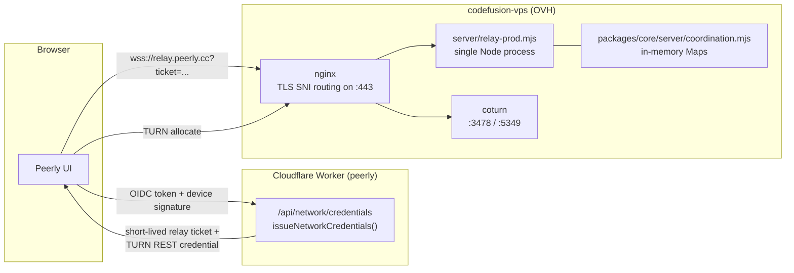
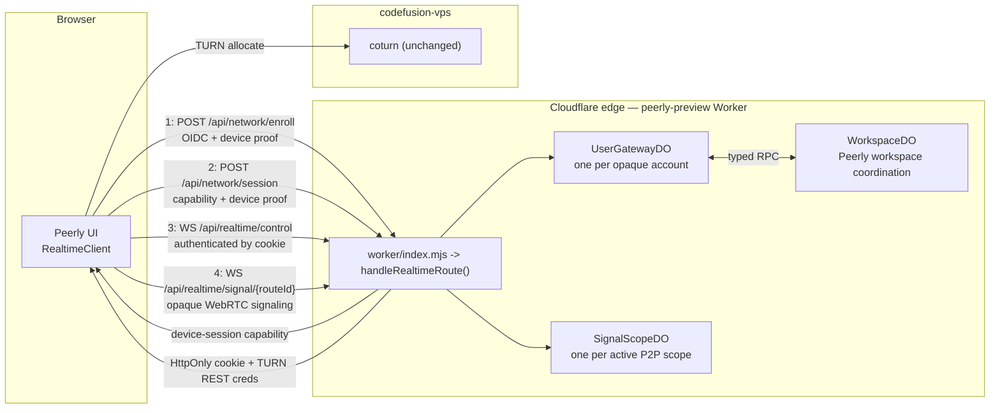

# ws-relay vs. Durable Objects: what changes and why

Status: current production vs. current preview, as implemented today  
Applies to: Peerly (`peerly.cc` vs `preview.peerly.cc`); the shared code paths
also back HeyHubs' own deployment  
Companion docs: [DURABLE_OBJECTS_ARCHITECTURE.md](./DURABLE_OBJECTS_ARCHITECTURE.md)
(the design decision and rollout plan this document assumes),
[DURABLE_OBJECTS_IMPLEMENTATION.md](./DURABLE_OBJECTS_IMPLEMENTATION.md) (exact
wire/file specifics), [relay-deployment.md](./relay-deployment.md) /
[production-rollout.md](./production-rollout.md) (today's relay ops)

This document compares the two *coordination* backends Peerly can run against —
the self-hosted `ws-relay` + coturn VPS stack that production uses today, and
the Cloudflare Workers + Durable Objects control plane that currently backs
only the stable preview deployment. It does not cover WebRTC media itself:
chat, files, and calls are peer-to-peer under **both** backends, and that does
not change.

## TL;DR

| | **ws-relay** (production, `peerly.cc`) | **Durable Objects** (preview, `preview.peerly.cc`) |
|---|---|---|
| Selects via | `COORDINATION_BACKEND=legacy-relay` (default) | `COORDINATION_BACKEND=durable-objects` |
| Client picks it with | `VITE_SIGNALING=ws-relay` (or `nostr`/`supabase`, which don't touch the VPS coordinator at all) | `VITE_SIGNALING=durable-objects` |
| Hosting | One Node process on one VPS (`codefusion-vps`) | One Cloudflare Worker + Durable Object namespace per app, on Cloudflare's edge |
| Coordination state | In-process JS `Map`s — gone on restart | SQLite per Durable Object, survives restarts and hibernation |
| Presence/matching | Best-effort, single process, `setInterval` sweep | Persisted, alarm-driven, two-phase reservation for matching |
| Scaling | Manual — run a second independent stack and split clients across `VITE_RELAY_HOSTS` | Automatic per-object; Cloudflare places/moves objects |
| Redundancy | Operator-provisioned (two VPS stacks, two regions) | Cloudflare's platform; no VPS to duplicate |
| Cost model | Fixed VPS bill regardless of traffic | Pay-per-use, comfortably inside the Workers Free plan at current scale |
| TURN | coturn on the same VPS either way (this part is unchanged in both backends today) | |
| Status | Production default | Preview only; production cutover is Phase 5 of the architecture plan |

## What stays identical either way

- **No message/file/call content ever reaches either backend.** Both are
  signaling/coordination only — WebRTC data/media stays P2P.
- **No static, long-lived relay or TURN credential ships in the bundle.**
  Both mint short-lived, device-bound credentials at connect time (relay
  tickets + coturn REST credentials via `/api/network/credentials` for
  ws-relay; a capability + cookie + coturn REST credentials via
  `/api/network/enroll` and `/api/network/session` for Durable Objects).
- **An established P2P session survives a coordination-plane hiccup** in
  both designs — losing the relay/control socket does not tear down an
  already-connected call or room.
- **coturn is still the TURN server today** in both cases. Durable Objects
  changes who *hands out* credentials for it, not what serves the relayed
  media. (Phase 6 of the architecture plan separately evaluates retiring
  coturn for Cloudflare Realtime TURN — that decision is independent of the
  coordination-backend choice.)

## How the ws-relay stack works today

1. **Credential minting** ([`packages/core/worker/networkCredentials.mjs`](../packages/core/worker/networkCredentials.mjs)):
   the Worker verifies the OIDC ID token, the live device signature over it,
   then mints an audience-bound relay ticket (`RELAY_TICKET_SECRET`) and a
   coturn REST credential (`TURN_AUTH_SECRET`), both expiring in at most ten
   minutes.
2. **Transport** ([`server/relay-prod.mjs`](../server/relay-prod.mjs)): a
   single Node process behind loopback-only nginx, built on
   [`packages/core/server/boundedRelay.mjs`](../packages/core/server/boundedRelay.mjs).
   Every WebSocket upgrade must present that ticket; `verifyClient` checks
   host + ticket before accepting. Per-client connection and message-rate
   caps are enforced with in-memory counters, not persisted state.
3. **Coordination** ([`packages/core/server/coordination.mjs`](../packages/core/server/coordination.mjs)):
   presence, interest-based seeking/matching, room directory, and channel
   fanout all live in plain `Map`s (`presence`, `seekers`, `rooms`,
   `pendingMatches`, `channels`, …) inside that one process, expired by a
   single `setInterval` sweep. There is no persistence layer under any of
   this — a process restart or crash discards all of it instantly; connected
   clients reconnect and re-advertise from scratch.
4. **Liveness**: a 30-second ping/pong heartbeat evicts sockets whose owning
   tab crashed or lost network without a clean close (`relay-prod.mjs`); this
   is an application-level timer that must keep the process awake
   continuously.
5. **TURN and routing** ([`turn-relay-vps.md`](./turn-relay-vps.md)): nginx
   uses TLS SNI preread to route `turn.peerly.cc` to coturn and everything
   else to the relay, all on one public IPv4 address.
6. **Redundancy and scaling are entirely operator-driven**
   ([`production-rollout.md`](./production-rollout.md)): the documented
   production posture is to stand up **two independent relay/TURN stacks**
   (different providers/regions) and give the client both via
   `VITE_RELAY_HOSTS`, with the client rotating on disconnect. Nothing does
   this automatically; it is provisioned and monitored by hand (`/healthz`,
   `/readyz`, `/metrics` + Prometheus, systemd, log rotation, manual capacity
   planning).

## How the Durable Objects control plane works

1. **Enrollment and session** ([`packages/core/worker/realtime/auth.mjs`](../packages/core/worker/realtime/auth.mjs),
   [`router.mjs`](../packages/core/worker/realtime/router.mjs)): the same
   OIDC + live device-signature verification as today, but the result is a
   30-day device-session **capability** (opaque HMAC user ID, device-key ID,
   session ID — never the raw email or provider subject), exchanged for a
   short-lived `Secure; HttpOnly; SameSite=Strict` cookie plus TURN REST
   credentials on every `/api/network/session` call.
2. **`UserGatewayDO`** ([`packages/core/worker/realtime/userGateway.mjs`](../packages/core/worker/realtime/userGateway.mjs)):
   one Durable Object per opaque account, holding that account's control
   WebSocket(s), device/session revocation epochs, matchmaking/reservation
   state, and idempotency keys — in **SQLite**, not a process-local `Map`. It
   uses `ctx.acceptWebSocket()`/hibernation: Cloudflare can put the object to
   sleep between messages and it resumes from `ctx.getWebSockets()` plus
   serialized attachments, rather than needing to stay resident (and billed)
   the whole time.
3. **`SignalScopeDO`** ([`signalScope.mjs`](../packages/core/worker/realtime/signalScope.mjs)):
   one object per active P2P scope (a workspace, a DM, a room), forwarding
   only opaque WebRTC offer/answer/ICE envelopes — it never sees chat, files,
   or media. This is what `VITE_SIGNALING=durable-objects` actually uses in
   place of Nostr/ws-relay/Supabase for the signaling handshake itself (see
   [`packages/core/src/realtime/signaling.ts`](../packages/core/src/realtime/signaling.ts)
   and [`joinRoom.ts`](../packages/core/src/joinRoom.ts)).
4. **`WorkspaceDO`** ([`workspace.mjs`](../packages/core/worker/realtime/workspace.mjs)):
   Peerly-only; carries workspace presence, signed member/device capability
   versions, and friend-invite/device-sync notifications, delivered through
   the requesting account's `UserGatewayDO`.
5. **Client state machine** ([`packages/core/src/realtime/client.ts`](../packages/core/src/realtime/client.ts)):
   an explicit `offline -> enrolling -> session -> connecting -> ready` cycle
   with exponential jittered backoff, a resumable server sequence number, and
   a bounded command queue — versus the relay's raw WebSocket pass-through
   with no resume semantics of its own.
6. **Persistence and correctness rules** (see the architecture doc's
   "Persistence and concurrency rules"): every table has bounded retention
   and an indexed expiry column, one alarm per object drives expiry, and
   correctness state is persisted before it is acknowledged. Matching across
   multiple interests uses an explicit two-phase reservation
   (`InterestQueueDO`, HeyHubs-only) specifically to make "duplicate
   committed match" a zero-tolerance, tested property — something the legacy
   coordinator's in-memory `pendingMatches` map does not formally guarantee
   under a race.
7. **Deployment** ([`wrangler.preview.jsonc`](../wrangler.preview.jsonc)):
   Durable Object bindings + a `realtime-v1` SQLite migration, its own
   secrets (`NETWORK_SESSION_SECRET`, `OPAQUE_USER_ID_SECRET`,
   `TURN_AUTH_SECRET`, …), and `head_sampling_rate: 1` observability — kept in
   a separate config file from production specifically because Cloudflare
   rejects a Durable Object migration on the `wrangler versions upload` path
   that Workers Builds uses for every non-production branch.

## Side-by-side detail

| Dimension | ws-relay (production) | Durable Objects (preview) |
|---|---|---|
| **Where state lives** | JS `Map`s in one Node process's memory | SQLite inside each Durable Object |
| **Survives a restart/crash?** | No — presence, pending matches, room directory all vanish | Yes — reloaded from SQLite; sockets resume via serialized attachments |
| **Idle cost** | A full VPS process running continuously, 30s heartbeat timer keeping it awake | Hibernatable — near-zero cost while no messages are flowing; no app-level heartbeat allowed by design |
| **Horizontal scaling** | Manual: stand up a second independent stack, split clients via `VITE_RELAY_HOSTS` | Automatic per-object; sharded DO classes (`PresenceStatsShardDO`, `RoomDirectoryShardDO`, HeyHubs-only) raise a shard constant instead of re-architecting |
| **Geographic distribution** | One VPS region (plus however many extra regions you provision by hand) | Cloudflare's edge network |
| **Auth artifact** | Short-lived relay ticket (`RELAY_TICKET_SECRET`) + TURN REST credential, both ≤10 min | 30-day device-session capability → 10-minute HttpOnly cookie + TURN REST credential |
| **Matching correctness** | Best-effort against one in-memory map; no formal duplicate-match guarantee under races | Two-phase reservation across gateways; "duplicate committed match: zero" is a tested SLO target |
| **Overload behavior** | Rate limits close a socket with codes 1008/1013 once in-memory counters trip | Same idea, plus a designed `429`/`503` fail-closed path before Cloudflare's own free-tier quota is exhausted |
| **Observability** | Prometheus `/metrics` scraped from the VPS | Structured events + Cloudflare dashboards, budgeted against explicit Free-plan allowances |
| **Ops burden** | systemd units, nginx TLS-SNI routing, coturn config, log rotation, manual secret rotation, capacity planning | Wrangler deploy + secrets; Cloudflare owns process supervision and placement |
| **Cost model** | Fixed VPS bill regardless of load | Pay-per-use; current Workers Free-plan allowances are 100,000 DO requests/day, 13,000 GB-s/day, 5,000,000 SQLite rows read/day, 100,000 rows written/day, 5 GB stored — a target to engineer within, not a guarantee, and re-checked before every capacity review |
| **Shared across Peerly + HeyHubs?** | Each app talks to the same VPS relay process today, but the coordination logic (`packages/core/server/coordination.mjs`) is one shared, single-tenant-shaped module | Each app deploys its **own** Worker + DO namespace from the same shared `packages/core` implementation — isolated data, secrets, and failure domain per app, so a bad HeyHubs release cannot take down Peerly's coordination |
| **Rollback** | Redeploy the VPS process / revert config | Flip `COORDINATION_BACKEND` back to `legacy-relay`; both backends exist side by side, clients never dual-write |
| **Current status** | Production default (`peerly.cc`) | Preview only (`preview.peerly.cc`); production cutover is a distinct, gated phase |

## Concrete benefits of the Durable Objects approach

1. **No self-managed process to keep alive.** The relay's biggest single
   operational fact is that its entire coordination state is one Node
   process's memory — every crash, redeploy, or OOM is a full state wipe for
   presence/matching/rooms. Durable Objects persist that same state to
   SQLite and resume it after hibernation, restart, or a Cloudflare-driven
   object migration.
2. **Elastic, near-zero idle cost instead of a flat VPS bill.** A connected
   but silent user costs nothing extra under hibernation; the relay's
   process (and its 30-second heartbeat) runs at full cost whether anyone is
   talking or not.
3. **Formally correct matching under concurrency.** The two-phase
   gateway-reservation protocol makes "two different interests can't commit
   the same user to two matches at once" a tested invariant, not an
   emergent property of one process handling requests in order.
4. **Cloudflare's edge instead of one VPS region.** Control-plane latency
   for a geographically distributed user base no longer depends on how many
   extra relay regions were manually provisioned.
5. **No manual redundancy provisioning.** Today's documented production
   posture is literally "run two independent relay/TURN stacks and hope the
   client's failover list covers you." Durable Objects get Cloudflare's own
   placement and redundancy for free.
6. **One shared, tested implementation instead of two products each
   maintaining relay-shaped code.** `packages/core/worker/realtime` is the
   single implementation both Peerly and HeyHubs deploy from, with their own
   isolated data — versus each product depending on the same shared VPS
   process today.
7. **Explicit, budgeted overload behavior.** The design requires the Worker
   to fail closed with `429`/`503` and `Retry-After` *before* Cloudflare
   quota exhaustion causes undefined behavior — a stated design constraint,
   not a reactive incident response.
8. **A real client resume protocol.** Versioned frames, a server-acked
   sequence number, and explicit `offline -> enrolling -> session ->
   connecting -> ready` states replace the relay's raw socket pass-through,
   which has no resume semantics beyond "reconnect and re-advertise."

## Honest trade-offs — what's not simply better

- **New platform dependency.** The control plane now depends on Cloudflare
  Workers/Durable Objects specifically, including its quota model, pricing,
  and API surface, in place of a generic VPS anyone could replicate on any
  host.
- **Free tier is an engineering target, not a guarantee** — the architecture
  doc says this explicitly. The daily allowance numbers above must be
  re-verified against Cloudflare's current pricing/limits before every
  capacity review, and sustained traffic above 75% of any allowance is meant
  to trigger a move to Workers Paid, not silent degradation.
- **New topology to get right.** Object keying, sharding constants, alarm
  scheduling, and cross-DO reservation/compensation logic are new surface
  area that a single in-memory `Map` simply didn't have. The
  [audit doc](./DURABLE_OBJECTS_AUDIT.md) already found and fixed several
  issues in this new code, and a [client-side capability-caching bug](../packages/core/src/realtime/client.ts)
  (an empty-string "cleared" marker being resent forever instead of
  triggering re-enrollment) was found and fixed after this document's
  predecessor work — new coordination logic keeps surfacing new correctness
  edges that a simpler relay didn't have to get right.
- **TURN is unchanged either way, for now.** Both backends still depend on
  the same self-hosted coturn on the VPS; Durable Objects has not yet
  removed that dependency (Phase 6 evaluates but has not adopted Cloudflare
  Realtime TURN as a replacement).
- **It is not yet production.** Every benefit above is currently validated
  only against the preview deployment. The architecture doc's Phase 5 exit
  criteria (seven days with no severity-1/2 correctness or privacy incident,
  SLOs met, projected usage under 75% of Free allowances) gate the actual
  production cutover, and production still runs — and depends on — the
  relay stack described in the first half of this document.

## Where this sits in the rollout

See [DURABLE_OBJECTS_ARCHITECTURE.md](./DURABLE_OBJECTS_ARCHITECTURE.md) for
the full phase-by-phase plan (Phase 0 through Phase 7) and the production
acceptance checklist. As implemented today: Phases 1–3 (shared protocol/auth,
DO signaling, Peerly workspace coordination) are built and running in
Peerly's preview deployment; Phase 5 (production cutover) and Phase 6 (VPS
relay shutdown) have not happened — production still runs
`COORDINATION_BACKEND=legacy-relay` end to end.
